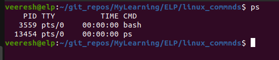
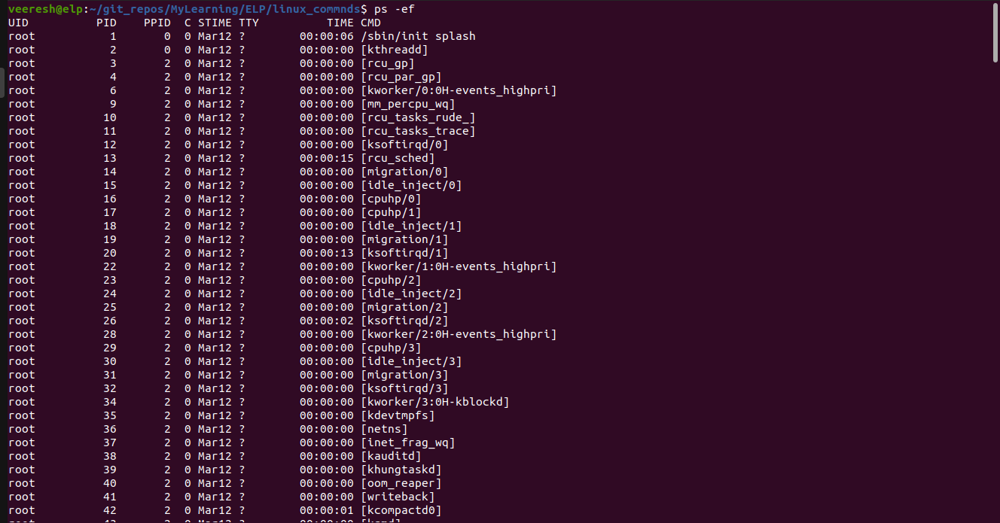
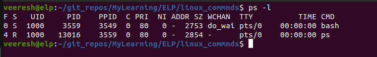
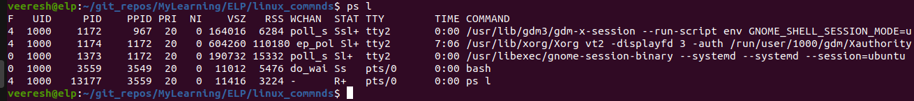
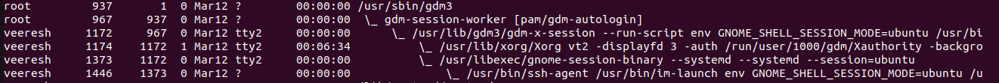
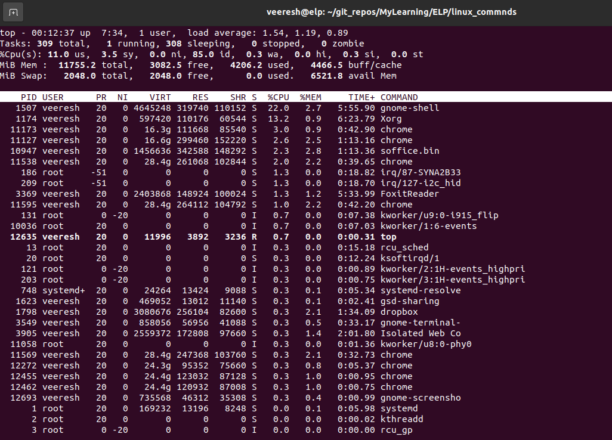
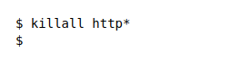

# How to Manage processes in Linux
## How to Monitor Programs
How do you keep track of what's running on the system? Especially now, when graphical desktops take a handful of programs just to produce a single desktop. You always have lots of programs running on the system.
This section covers a few of the basic tools you need to know how to use to manage programs on your Linux system.

When a program runs on the system, it’s referred to as a process.
ps is the commands which produce lots of information about all the programs running on your system. 
That said, however, the basic ps command doesn’t really provide all that much information:

By default, the ps command shows only the processes that belong to the current user and that are running on the current terminal. In this case, we had only our bash shell running (remember, the shell is just another program running on the system) and, of course, the ps command itself.

The basic output shows the process ID (PID) of the programs, the terminal (TTY) that they are running from, and the CPU time the process has used.

The GNU ps command that’s used in Linux systems supports three different types of command line parameters:
1. Unix-style parameters, which are preceded by a dash
2. BSD-style parameters, which are not preceded by a dash
3. GNU long parameters, which are preceded by a double dash

### Unix-style parameters
The Unix-style parameters originated with the original ps command that ran on the AT&T Unix systems invented by Bell Labs.
Table below shows these parameters.
| Parameter | Description                                                                                 |
| --------- | ------------------------------------------------------------------------------------------- |
| \-A       | Shows all processes                                                                         |
| \-N       | Shows the opposite of the specified parameters                                              |
| \-a       | Shows all processes except session headers and processes without a terminal                 |
| \-d       | Shows all processes except session headers                                                  |
| \-e       | Shows all processes                                                                         |
| \-C       | cmslist Shows processes contained in the list cmdlist                                       |
| \-G       | grplist Shows processes with a group ID listed in grplist                                   |
| \-U       | userlist Shows processes owned by a userid listed in userlist                               |
| \-g       | grplist Shows processes by session or by groupid contained in grplist                       |
| \-p       | pidlist Shows processes with PIDs in the list pidlist                                       |
| \-s       | sesslist Shows processes with session ID in the list sesslist                               |
| \-t       | ttylist Shows processes with terminal ID in the list ttylist                                |
| \-u       | userlist Shows processes by effective userid in the list userlist                           |
| \-F       | Uses extra full output                                                                      |
| \-O       | format Displays specific columns in the list format, along with the default columns columns |
| \-M       | Displays security information about the process                                             |
| \-c       | Shows additional scheduler information about the process                                    |
| \-f       | Displays a full format listing                                                              |
| \-j       | Shows job information                                                                       |
| \-l       | Displays a long listing                                                                     |
| \-o       | format Displays only specific columns listed in format                                      |
| \-y       | Prevents display of process flags                                                           |
| \-Z       | Displays the security context information                                                   |
| \-H       | Displays processes in a hierarchical format (showing parent processes)                      |
| \-n       | namelist Defines the values to display in the WCHAN column                                  |
| \-w       | Uses wide output format, for unlimited width displays                                       |
| \-L       | Shows process threads                                                                       |
| \-V       | Displays the version of ps                                                                  |

That’s a lot of parameters, and there are still more! The key to using the ps command is not
to memorize all the available parameters — only those you find most useful. 

For example, if you need to see everything running on the system, use
the -ef parameter combination (the ps command lets you combine parameters like this):

Quite a few lines have been cut from the output to save space, but you can see that lots of processes are running on a Linux system. 
This example uses two parameters: the -e parameter, which shows all the processes running on the system, and the -f parameter, which expands the output to show a few useful columns of information:
1. UID: The user responsible for launching the process
2. PID: The process ID of the process
3. PPID: The PID of the parent process (if a process is started by another process)
4. C: Processor utilization over the lifetime of the process
5. STIME: The system time when the process started
6. TTY: The terminal device from which the process was launched
7. TIME: The cumulative CPU time required to run the process
8. CMD: The name of the program that was started

For even more information, you can use the -l parameter, which produces
the long format output:

Notice the extra columns that appear when you use the -l parameter:
1. F: System flags assigned to the process by the kernel 2. S: The state of the process (O = running on processor; S = sleeping; R = runnable, waiting to run; Z = zombie, process terminated but parent not available; T = process stopped)
2. PRI: The priority of the process (higher numbers mean lower priority)
3. NI: The nice value, which is used for determining priorities
4. ADDR: The memory address of the process
5. SZ: Approximate amount of swap space required if the process was swapped out
6. WCHAN: Address of the kernel function where the process is sleeping

### BSD-style parameters
Now let’s look at the BSD-style parameters.
Table below shows the BSD version of the ps command parameters.

| Parameter  | Description                                                                                           |
| ---------- | ----------------------------------------------------------------------------------------------------- |
| T          | Shows all processes associated with this terminal                                                     |
| a          | Shows all processes associated with any terminal                                                      |
| g          | Shows all processes including session headers                                                         |
| r          | Shows only running processes                                                                          |
| x          | Shows all processes, even those without a terminal device assigned                                    |
| U          | userlist Shows processes owned by a userid listed in userlist                                         |
| p          | pidlist Shows processes with a PID listed in pidlist                                                  |
| t          | ttylist Shows processes associated with a terminal listed in ttylist                                  |
| O          | format Lists specific columns in format to display along with the standard columns                    |
| X          | Displays data in the register format                                                                  |
| Z          | Includes security information in the output                                                           |
| j          | Shows job information                                                                                 |
| l          | Uses the long format                                                                                  |
| o format   | Displays only columns specified in format                                                             |
| s          | Uses the signal format                                                                                |
| u          | Uses the user-oriented format                                                                         |
| v          | Uses the virtual memory format                                                                        |
| N namelist | Defines the values to use in the WCHAN column                                                         |
| O          | order Defines the order in which to display the information columns                                   |
| S          | Sums numerical information, such as CPU and memory usage, for child processes into the parent process |
| c          | Displays the true command name (the name of the program used to start the process)                    |
| e          | Displays any environment variables used by the command                                                |
| f          | Displays processes in a hierarchical format, showing which processes started which processes          |
| h          | Prevents display of the header information                                                            |
| k sort     | Defines the column(s) to use for sorting the output                                                   |
| n          | Uses numeric values for user and group IDs, along with WCHAN information                              |
| w          | Produces wide output for wider terminals                                                              |
| H          | Displays threads as if they were processes                                                            |
| m          | Displays threads after their processes                                                                |
| L          | Lists all format specifiers                                                                           |
| V          | Displays the version of ps                                                                            |

As you can see, the Unix and BSD types of parameters have lots of overlap. Most of the information you can get from one you can also get from the other.
When you use the BSD-style parameters, the ps command automatically changes the output to simulate the BSD format. Here’s an example using the l parameter:

Notice that while many of the output columns are the same as when we used the Unix-style parameters, some different ones appear as well:
1. VSZ: The size in kilobytes of the process in memory
2. RSS: The physical memory that a process has used that isn’t swapped out
3. STAT: A two-character state code representing the current process state

Many system administrators like the BSD-style l parameter because it produces a more detailed state code for processes (the STAT column). The two-character code more precisely defines exactly what’s happening with the process than the single-character Unix-style output.

The first character uses the same values as the Unix-style S output column, showing when a process is sleeping, running, or waiting. The second character further defines the process’s status:
1. <: The process is running at high priority.
2. N: The process is running at low priority.
3. L: The process has pages locked in memory.
4. s: The process is a session leader.
5. l: The process is multi-threaded.
6. +: The process is running in the foreground.

### The GNU long parameters
The GNU developers put their own touches on the new, improved ps command by adding a few more options to the parameter mix. Some of the GNU long parameters copy existing Unix- or BSD-style parameters, while others provide new features. Table below lists the available GNU long parameters.

| Parameter        | Description                                                           |
| ---------------- | --------------------------------------------------------------------- |
| \--deselect      | Shows all processes except those listed in the command line           |
| \--Group grplist | Shows processes whose group ID is listed in grplist                   |
| \--User userlist | Shows processes whose user ID is listed in userlist                   |
| \--group grplist | Shows processes whose effective group ID is listed in grplist         |
| \--pid pidlist   | Shows processes whose process ID is listed in pidlist                 |
| \--ppid pidlist  | Shows processes whose parent process ID is listed in pidlist          |
| \--sid sidlist   | Shows processes whose session ID is listed in sidlist                 |
| \--tty ttylist   | Shows processes whose terminal device ID is listed in ttylist         |
| \--User userlist | Shows processes whose effective user ID is listed in userlist         |
| \--format format | Displays only columns specified in the format                         |
| \--context       | Displays additional security information                              |
| \--cols n        | Setsscreen width to n columns                                         |
| \--columns n     | Sets screen width to n columns                                        |
| \--cumulative    | Includes stopped child process information                            |
| \--forest        | Displays processes in a hierarchical listing showing parent processes |
| \--headers       | Repeats column headers on each page of output                         |
| \--no-headers    | Prevents display of column headers                                    |
| \--lines n       | Sets the screen height to n lines                                     |
| \--rows n        | Sets the screen height to n rows                                      |
| \--sort order    | Defines the column(s) to use for sorting the output                   |
| \--width n       | Sets the screen width to n columns                                    |
| \--help          | Displays the help information                                         |
| \--info          | Displays debugging information                                        |
| \--version       | Displays the version of the ps program                                |

You can combine GNU long parameters with either Unix- or BSD-style parameters to really customize your display. One cool feature of GNU long parameters that we really like is the --forest parameter. It displays the hierarchical process information, but using ASCII characters to draw cute charts:

This format makes tracing child and parent processes a snap!

### Real-time process monitoring

The ps command is great for gleaning information about processes running on the system, but it has one drawback. The ps command can display information only for a specific point in time. If you’re trying to find trends about processes that are frequently swapped in and out of memory, it’s hard to do that with the ps command.

Instead, the top command can solve this problem. The top command displays process information similarly to the ps command, but it does it in real-time mode. Figure below is a snapshot of the top command in action.

The first section of the output shows general system information. The first line shows the current time, how long the system has been up, the number of users logged in, and the load average on the system.

The load average appears as three numbers: the 1-minute, 5-minute, and 15-minute load averages. The higher the values, the more load the system is experiencing. It’s not uncommon for the 1-minute load value to be high for short bursts of activity. If the 15-minute load value is high, your system may be in trouble.

The second line shows general process information (called tasks in top): how many processes are running, sleeping, stopped, and zombie (have finished but their parent process hasn’t responded).

The next line shows general CPU information. The top display breaks down the CPU utilization into several categories depending on the owner of the process (user versus system processes) and the state of the processes (running, idle, or waiting).

Following that are two lines that detail the status of the system memory. The first line shows the status of the physical memory in the system, how much total memory there is, how much is currently being used, and how much is free. The second memory line shows the status of the swap memory area in the system (if any is installed), with the same information.

Finally, the next section shows a detailed list of the currently running processes, with some information columns that should look familiar from the ps command output:

1. PID: The process ID of the process
2. USER: The user name of the owner of the process
3. PR: The priority of the process
4. NI: The nice value of the process
5. VIRT: The total amount of virtual memory used by the process
6. RES: The amount of physical memory the process is using
7. SHR: The amount of memory the process is sharing with other processes
8. S: The process status (D = interruptible sleep, R = running, S = sleeping, T = traced or stopped, or Z = zombie)
9. %CPU: The share of CPU time that the process is using
10. %MEM: The share of available physical memory the process is using
11. TIME+: The total CPU time the process has used since starting
12. COMMAND: The command line name of the process (program started)

By default, when you start top, it sorts the processes based on the %CPU value. You can change the sort order by using one of several interactive commands while top is running. Each interactive command is a single character that you can press while top is running and changes the behavior of the program. Pressing f allows you to select the field to use to sort the output, and pressing d allows you to change the polling interval. Press q to exit the top display.

### Stopping processes

A crucial part of being a system administrator is knowing when and how to stop a process. Sometimes, a process gets hung up and needs a gentle nudge to either get going again or stop. Other times, a process runs away with the CPU and refuses to give it up. In both cases, you need a command that allows you to control a process. Linux follows the Unix method of interprocess communication.

In Linux, processes communicate with each other using signals. A process signal is a predefined message that processes recognize and may choose to ignore or act on. The developers program how a process handles signals. Most well-written applications have the ability to receive and act on the standard Unix process signals. Table below shows these signals.

| Signal | Name | Description                                         |
| ------ | ---- | --------------------------------------------------- |
| 1      | HUP  | Hangs up                                            |
| 2      | INT  | Interrupts                                          |
| 3      | QUIT | Stops running                                       |
| 9      | KILL | Unconditionally terminates                          |
| 11     | SEGV | Produces segment violation                          |
| 15     | TERM | Terminates if possible                              |
| 17     | STOP | Stops unconditionally, but doesn’t terminate        |
| 18     | TSTP | Stops or pauses, but continues to run in background |
| 19     | CONT | Resumes execution after STOP or TSTP                |

Two commands available in Linux allow you to send process signals to running processes.

1. The kill command

The kill command allows you to send signals to processes based on their process ID (PID). By default, the kill command sends a TERM signal to all the PIDs listed on the command line. Unfortunately, you can only use the process PID instead of its command name, making the kill command difficult to use sometimes.

To send a process signal, you must either be the owner of the process or be logged in as the root user.

2. The killall command

The killall command is a powerful way to stop processes by using their names rather than the PID numbers. The killall command allows you to use wildcard characters as well, making it a very useful tool when you have a system that’s gone awry:

This example kills all the processes that start with http, such as the httpd services for the Apache web server

Note: Be extremely careful using the killall command when logged in as the root user. It’s easy to get carried away with wildcard characters and accidentally stop important system processes. This could lead to a damaged filesystem.

Reference: Linux® Command Line and Shell Scripting Bible - Richard Blum, Christine Bresnahan