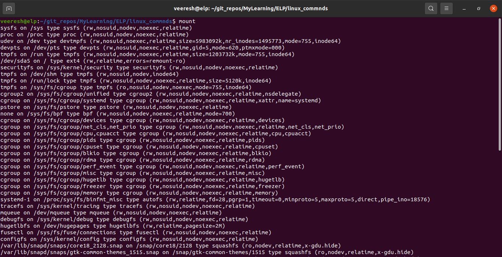
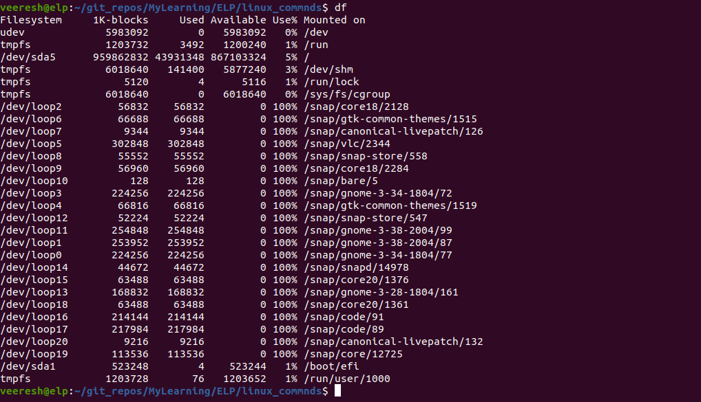
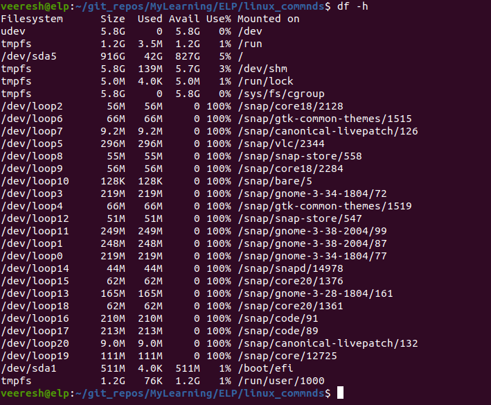
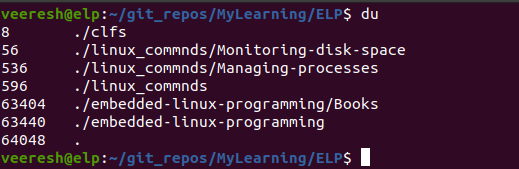

# How to Monitor Disk Space in Linux

One important thing is how do you keep track of the disk usage on the system. Whether you are running a simple Linux desktop or a large Linux server, you need to know how much space you have for your applications.

Some commands can help you manage the media environment on your Linux system. This post describes the core commands you will likely run into during your system administration duties or when you want to know the disk usage on the system.
 
## How to Mount and Unmount media
The Linux filesystem combines all media disks into a single virtual directory. Before you can use a new media disk on your system, you must place it in the virtual directory. This task is called mounting.

In today’s graphical desktop world, most Linux distributions have the ability to automatically mount specific types of removable media. If you are not using a distribution that automatically mounts and unmounts removable media, you have to do it yourself. This section describes the Linux command line commands to help you manage your removable media devices.

### The mount command
The command used to mount media is called mount. By default, the mount command displays a list of media devices currently mounted on the system as shown below:

The mount command provides four pieces of information:
1. The device filename of the media
2. The mount point in the virtual directory where the media is mounted
3. The filesystem type
4. The access status of the mounted media

To manually mount a media device in the virtual directory, you must be logged in as the root user or use the sudo command to run the command as the root user. The following is the basic command for manually mounting a media device:

mount -t type device directory

The type parameter defines the filesystem type under which the disk was formatted. Linux recognizes lots of different filesystem types. If you share removable media devices with your Windows PCs, you are most likely to run into these types:

1. vfat: Windows long filesystem
2. ntfs: Windows advanced filesystem used in Windows NT, XP, and Vista
3. iso9660: The standard CD-ROM filesystem

Most USB memory sticks and floppies are formatted using the vfat filesystem. If you need to mount a data CD, you must use the iso9660 filesystem type.

The next two parameters define the location of the device file for the media device and the location in the virtual directory for the mount point. For example, to manually mount the USB memory stick at device /dev/sdb1 at location /media/disk, you use the following command:

mount -t vfat /dev/sdb1 /media/disk

After a media device is mounted in the virtual directory, the root user has full access to the device, but access by other users is restricted. You can control who has access to the device using directory permissions (chmod command).

In case you need to use some more features of the mount command, Table below shows the available parameters .

| Parameter | Description                                                                       |
| --------- | --------------------------------------------------------------------------------- |
| \-a       | Mounts all filesystems specified in the /etc/fstab file                           |
| \-f       | Causes the mount command to simulate mounting a device, but not actually mount it |
| \-F       | Mounts all filesystems at the same time when used with the -a parameter           |
| \-v       | Explains all the steps required to mount the device; stands for verbose mode      |
| \-I       | Tells you not to use any filesystem helper files under /sbin/mount .filesystem    |
| \-l       | Adds the filesystem labels automatically for ext2, ext3, or XFS filesystems       |
| \-n       | Mounts the device without registering it in the /etc/mstab mounted device file    |
| \-p       | num For encrypted mounting, reads the passphrase from the file descriptor num     |
| \-s       | Ignores mount options not supported by the filesystem                             |
| \-r       | Mounts the device as read-only                                                    |
| \-w       | Mounts the device as read-write (the default)                                     |
| \-L lable | Mounts the device with the specified label                                        |
| \-U uuid  | uuid Mounts the device with the specified uuid                                    |
| \-O       | When used with the -a parameter, limits the set of filesystems applied            |
| \-o       | Adds specific options to the filesystem                                           |

The -o option allows you to mount the filesystem with a comma-separated list of additional options. These are popular options to use:
1. ro: Mounts as read-only
2. rw: Mounts as read-write
3. user: Allows an ordinary user to mount the filesystem
4. check=none: Mounts the filesystem without performing an integrity check
5. loop: Mounts a file

### The unmount command
To remove a removable media device, you should never just remove it from the system. Instead, you should always unmount it first.

The command used to unmount devices is umount. The format for the umount command is:

umount [directory | device ]

The umount command gives you the choice of defining the media device by either its device location or its mounted directory name. If any program has a file open on a device, the system will not let you unmount it.

## How to Use the df command
Sometimes, you need to see how much disk space is available on an individual device. The df command allows you to easily see what’s happening on all the mounted disks:

The df command shows each mounted filesystem that contains data. As you can see from the mount command earlier, some mounted devices are used for internal system purposes.
The command displays the following:
1. The device location of the device
2. How many 1024-byte blocks of data it can hold
3. How many 1024-byte blocks are used
4. How many 1024-byte blocks are available
5. The amount of used space as a percentage
6. The mount point where the device is mounted

A few different command line parameters are available with the df command, most of which you will never use. One popular parameter is -h, which shows the disk space in humanreadable form, usually as an M for megabytes or a G for gigabytes:

Note: Remember that the Linux system always has processes running in the background that handle fi les. The values from the df command refl ect what the Linux system thinks are the current values at that point in time. It is possible that you have a process running that has created or deleted a file but has not released the file yet. This value is not included in the free space calculation.

## How to use the du command
The du command shows the disk usage for a specific directory (by default, the current directory). This is a quick way to determine if you have any obvious disk hogs on the system.

By default, the du command displays all the files, directories, and subdirectories under the current directory, and it shows how many disk blocks each file or directory takes. For a standard-sized directory, this can be quite a listing. Here’s a partial listing of using the du command:

The number at the left of each line is the number of disk blocks that each file or directory takes. Notice that the listing starts at the bottom of a directory and works its way up through the files and subdirectories contained within the directory.

The du command by itself can be somewhat useless. It is nice to be able to see how much disk space each individual file and directory takes up, but it can be meaningless when you have to wade through pages and pages of information before you find what you are looking for.

You can use a few command line parameters with the du command to make things a little more legible:
1. -c: Produces a grand total of all the files listed
2. -h: Prints sizes in human-readable form, using K for kilobyte, M for megabyte, and G for gigabyte
3. -s: Summarizes each argument

Reference: Linux® Command Line and Shell Scripting Bible - Richard Blum, Christine Bresnahan