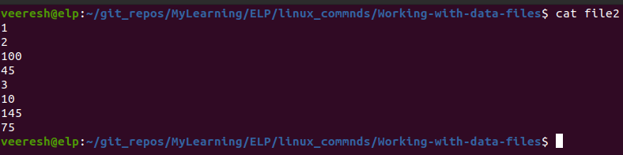
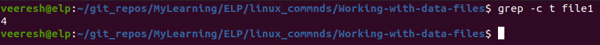

# How to Work with Data Files in Linux

When you have a large amount of data, handling the information and making it useful can be difficult. As you saw with the du command in the previous post, it’s easy to get data overload when working with system commands.

The Linux system provides several command line tools to help you manage large amounts of data. This post covers the basic commands that every system administrator — as well as any everyday Linux user — should know how to use to make their lives easier.
 
## How to Sort Data
The sort command is a popular function that comes in handy when working with large amounts of data. The sort command does what it says: It sorts data.

By default, the sort command sorts the data lines in a text file using standard sorting rules for the language you specify as the default for the session.

For example,

after the sort:

It is pretty simple, but things are not always as easy as they appear. Look at this example:

after the sort:

If you were expecting the numbers to sort in numerical order, you were disappointed. By default, the sort command interprets numbers as characters and performs a standard character sort, producing output that might not be what you want. To solve this problem, use the -n parameter, which tells the sort command to recognize numbers as numbers instead of characters and to sort them based on their numerical values:

Now, that is much better! Another common parameter that is used is -M, the month sort. Linux log files usually contain a timestamp at the beginning of the line to indicate when the event occurred:

Sep 13 07:10:09 testbox smartd[2718]: Device: /dev/sda, opened

If you sort a file that uses timestamp dates using the default sort, you get something like this:

It is not exactly what you wanted. If you use the -M parameter, the sort command recognizes the three-character month nomenclature and sorts appropriately:

Table below shows other handy sort parameters you can use.

| Single | Dash Double Dash             | Description                                                                                                                         |
| ------ | ---------------------------- | ----------------------------------------------------------------------------------------------------------------------------------- |
| \-b    | \--ignore-leading-blanks     | Ignores leading blanks when sorting                                                                                                 |
| \-C    | \--check = quiet Doesn’t     | sort, but doesn’t report if data is out of sort order                                                                               |
| \-c    | \--check                     | Doesn’t sort, but checks if the input data is already sorted, and reports if not sorted                                             |
| \-d    | \--dictionary-order          | Considers only blanks and alphanumeric characters; doesn’t consider special characters                                              |
| \-f    | \--ignore-case               | By default, sort orders capitalized letters first; ignores case                                                                     |
| \-g    | \--general-numeric-sort      | Uses general numerical value to sort                                                                                                |
| \-i    | \--ignore-nonprinting        | Ignores nonprintable characters in the sort                                                                                         |
| \-k    | \--key = POS1\[,POS2\]       | Sorts based on position POS1, and ends at POS2 if specified                                                                         |
| \-M    | \--month-sort                | Sorts by month order using three-character month names                                                                              |
| \-m    | \--merge                     | Merges two already sorted data files                                                                                                |
| \-n    | \--numeric-sort              | Sorts by string numerical value                                                                                                     |
| \-o    | \--output = file             | Writes results to file specified                                                                                                    |
| \-R    | \--random-sort               | Sorts by a random hash of keys                                                                                                      |
|        | \--random-source = FILE      | Specifies the file for random bytes used by the -R parameter                                                                        |
| \-r    | \--reverse                   | Reverses the sort order (descending instead of ascending                                                                            |
| \-S    | \--buffer-size = SIZE        | Specifies the amount of memory to use                                                                                               |
| \-s    | \--stable                    | Disables last-resort comparison                                                                                                     |
| \-T    | \--temporary-direction = DIR | Specifies a location to store temporary working files                                                                               |
| \-t    | \--field-separator = SEP     | Specifies the character used to distinguish key positions                                                                           |
| \-u    | \--unique                    | With the -c parameter, checks for strict ordering; without the -c parameter, outputs only the first occurrence of two similar lines |
| \-z    | \--zero-terminated           | Ends all lines with a NULL character instead of a new line                                                                          |

The -k and -t parameters are handy when sorting data that uses fields, such as the /etc/passwd file. Use the -t parameter to specify the field separator character, and use the -k parameter to specify which field to sort on. For example, to sort the password file based on numerical userid, just do this:

Now the data is perfectly sorted based on the third field, which is the numerical userid value.

The -n parameter is great for sorting numerical outputs, such as the output of the du command:

Notice that the -r option also sorts the values in descending order, so you can easily see what files are taking up the most space in your directory.

## How to Search for data

Often in a large file, you must look for a specific line of data buried somewhere in the middle of the file. Instead of manually scrolling through the entire file, you can let the grep command search for you. The command line format for the grep command is:

grep [options] pattern [file]

The grep command searches either the input or the file you specify for lines that contain characters that match the specified pattern. The output from grep is the lines that contain the matching pattern.

Here are two simple examples of using the grep command with the file1 file used in the “Sorting data” section:

The first example searches the file file1 for text matching the pattern three. The grep command produces the line that contains the matching pattern. The next example searches the file file1 for the text matching the pattern t. In this case, four lines matched the specified pattern, and both are displayed.

If you want to reverse the search (output lines that don’t match the pattern), use the -v parameter:

If you need to find the line numbers where the matching patterns are found, use the -n parameter:

If you just need to see a count of how many lines contain the matching pattern, use the -c parameter:

If you need to specify more than one matching pattern, use the -e parameter to specify each individual pattern:

This example outputs lines that contain either the string t or the string f.

By default, the grep command uses basic Unix-style regular expressions to match patterns. A Unix-style regular expression uses special characters to define how to look for matching patterns.

Here’s a simple example of using a regular expression in a grep search:

![grep[tf]](grep[tf]].png)

The square brackets in the regular expression indicate that grep should look for matches that contain either a t or an f character. Without the regular expression, grep would search for text that would match the string tf.

## How to Compress data

Linux contains several file compression utilities. Although this may sound great, it often leads to confusion and chaos when trying to download files. Table below lists the file compression utilities available for Linux.

| Utility  | File Extension | Description                                                                             |
| -------- | -------------- | --------------------------------------------------------------------------------------- |
| bzip2    | .bz2           | Uses the Burrows-Wheeler block sorting text compression algorithm and Huffman coding |
| compress | .Z             | Original Unix file compression utility; starting to fade away into obscurity         |
| gzip     | .gz            | The GNU Project’s compression utility; uses Lempel-Ziv Coding                        |
| zip      | .zip           | The Unix version of the PKZIP program for Windows                                       |

The compress file compression utility is not often found on Linux systems. If you download a file with a .Z extension, you can usually install the compress package (called ncompress in many Linux istributions) using the software installation methods discussed in Chapter 9 and then uncompress the file with the uncompress command. The gzip utility is the most popular compression tool used in Linux.

The gzip package is a creation of the GNU Project, in their attempt to create a free version of the original Unix compress utility. This package includes these files:
1. gzip for compressing files
2. gzcat for displaying the contents of compressed text files
3. gunzip for uncompressing files

These utilities work the same way as the bzip2 utilities:

The gzip command compresses the file you specify on the command line. You can also specify more than one filename or even use wildcard characters to compress multiple files at once:

The gzip command compresses every file in the directory that matches the wildcard pattern.

## How to Archive data
Although the zip command works great for compressing and archiving data into a single file, it’s not the standard utility used in the Unix and Linux worlds. By far the most popular archiving tool used in Unix and Linux is the tar command.

The tar command was originally used to write files to a tape device for archiving. However, it can also write the output to a file, which has become a popular way to archive data in Linux.

The following is the format of the tar command:

tar function [options] object1 object2 ...

The function parameter defines what the tar command should do, as shown in Table below.

| Function | Long Name      | Description                                                                                                         |
| -------- | -------------- | ------------------------------------------------------------------------------------------------------------------- |
| \-A      | \--concatenate | Appends an existing tar archive file to another existing tar archive file                                           |
| \-c      | \--create      | Creates a new tar archive file                                                                                      |
| \-d      | \--diff        | Checks the differences between a tar archive file and the file system                                            |
|          | \--delete      | Deletes from an existing tar archive file                                                                           |
| \-r      | \--append      | Appends files to the end of an existing tar archive file                                                            |
| \-t      | \--list        | Lists the contents of an existing tar archive file                                                                  |
| \-u      | \--update      | Appends files to an existing tar archive file that are newer than a file with the same name in the existing archive |
| \-x      | \--extract     | Extracts files from an existing archive file                                                                        |

Each function uses options to define a specific behavior for the tar archive file. Table below lists the common options that you can use with the tar command.

| Option   | Description                                              |
| -------- | -------------------------------------------------------- |
| \-C dir  | Changes to the specified directory                       |
| \-f file | Outputs results to file (or device) file                 |
| \-j      | Redirects output to the bzip2 command for compression    |
| \-p      | Preserves all file permissions                           |
| \-v      | Lists files as they are processed                        |
| \-z      | Redirects the output to the gzip command for compression |

These options are usually combined to create the following scenarios. First, you want to create an archive file using this command:

As you can see, using the tar command is a simple way to create archive files of entire directory structures. This is a common method for distributing source code files for open source applications in the Linux world.

The above command creates an archive file called commands.tar containing the contents Managing-processes, Monitoring-disk-space and Working-with-data-files directories Next, this command:

[tar-tf](tar-tf.png)

lists (but doesn’t extract) the contents of the tar file test.tar. Finally, this command:

[tar-xvf](tar-xvf.png)

extracts the contents of the tar file commands.tar. If the tar file was created from a directory structure, the entire directory structure is re-created starting at the current directory.

As you can see, using the tar command is a simple way to create archive files of entire directory structures. This is a common method for distributing source code files for open source applications in the Linux world.

Reference: Linux® Command Line and Shell Scripting Bible - Richard Blum, Christine Bresnahan